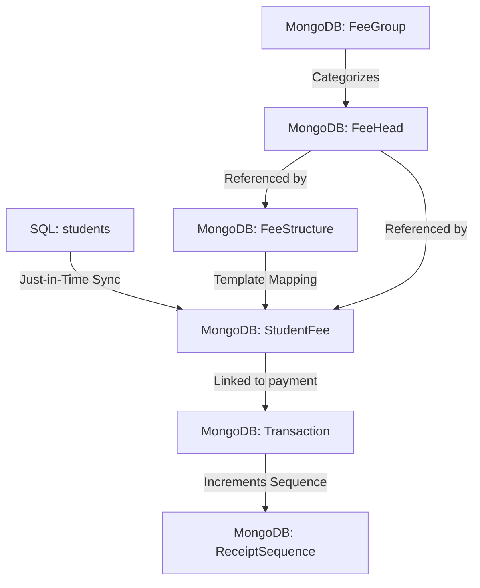
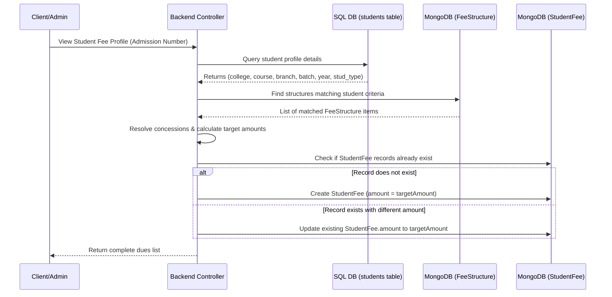

# Fee Collection and Mapping Architecture

This document describes the architectural flow, database schemas, and data mapping strategies used to configure, apply, and collect student fees. It bridges the SQL-based student records and the MongoDB-based Fee Configuration/Transaction system.

---

## 1. Core Architecture Overview

The system operates on a **hybrid database model**:
- **Relational (SQL Database)**: Stores primary student profiles, admissions, colleges, courses, branches, and student statuses.
- **Document-based (MongoDB NoSQL)**: Stores fee configurations (Fee Heads, Groups, Structures), individualized student fee demands (Student Fees), and receipted payments (Transactions).

---

## 2. Fee Structure Mapping

Fee structures act as templates. Instead of manually assigning fees to every student individually, administrators define rules for when specific fees apply.

### 2.1 The Mapping Criteria
A fee structure ([FeeStructure.js](file:///b:/PYDAH%20SOFT%20PROJECTS/Fee%20-%20Management/backend/models/FeeStructure.js)) specifies target criteria. A student must match all of these fields for the structure to apply:
1. **College**: E.g. "Pydah College of Engineering"
2. **Course**: E.g. "B.Tech"
3. **Branch**: E.g. "Computer Science & Engineering"
4. **Batch**: E.g. "2024", "2023-2027" (identifies the admission cohort)
5. **Category (stud_type)**: E.g. "Regular", "Management"
6. **Student Year**: E.g. 1, 2, 3, 4 (current year of study)
7. **Semester**: E.g. 1, 2 (optional; if omitted, the fee applies to the entire academic year)

### 2.2 Supporting Collections
The mapping relies on the following structural collections:

#### A. Fee Head ([FeeHead.js](file:///b:/PYDAH%20SOFT%20PROJECTS/Fee%20-%20Management/backend/models/FeeHead.js))
Defines individual fee items (e.g., Tuition Fee, Library Fee).
* **Parameters**:
  | Field Name | Type | Description |
  | :--- | :--- | :--- |
  | `name` | String (Required, Unique, Trimmed) | Display name of the fee head (e.g., "Tuition Fee"). |
  | `code` | String (Unique, Trimmed, Sparse) | Unique shortcode identifier (e.g., "TUI"). |
  | `description` | String (Optional) | Detailed explanation of the fee head. |

#### B. Fee Group ([FeeGroup.js](file:///b:/PYDAH%20SOFT%20PROJECTS/Fee%20-%20Management/backend/models/FeeGroup.js))
Groups related fee heads (e.g., "Academic Fees" group containing Tuition Fee and Exam Fee). Used for logical categorizations and receipt formatting.
* **Parameters**:
  | Field Name | Type | Description |
  | :--- | :--- | :--- |
  | `name` | String (Required, Unique) | Display name of the group. |
  | `code` | String (Required, Unique, Uppercase) | Code for the group (e.g., "ACAD", "HOSTEL"). |
  | `description` | String (Optional) | Description of the group. |
  | `feeHeads` | Array of ObjectIds (Ref: `FeeHead`) | The fee heads belonging to this group. |
  | `isActive` | Boolean (Default: `true`) | Flag to enable/disable the group. |

---

## 3. Applying Fee Structures to Students

The process of applying a fee structure to a student is called **Synchronizing Fee Demands**. This produces records in the `StudentFee` collection (which represents individual due items).

### 3.1 Synchronisation Triggers & Service
The sync process is implemented in [studentFeeSyncService.js](file:///b:/PYDAH%20SOFT%20PROJECTS/Fee%20-%20Management/backend/services/studentFeeSyncService.js) and triggers:
- Automatically when an administrator loads the student's due profile on the **Fee Collection Page**.
- When importing/syncing student profiles or approving concessions.

### 3.2 Step-by-Step Sync Workflow

### 3.3 Target Amount Resolution & Concessions
During sync, the standard structure amount is evaluated against any approved overall concessions:
1. The backend queries SQL `overall_concessions` for the student's admission number.
2. If a concession exists for the corresponding `feeHead`, `studentYear`, and `semester`, it is matched.
3. The function `resolveTargetAmount` calculates the revised fee:
   - If the concession specifies a fixed revised amount, it sets that.
   - If it specifies a waiver percentage, it deducts it from the structure's default amount.

### 3.4 Club Fees Special Case
Students can join multiple clubs, each with its own fee.
- SQL tables `club_members` and `clubs` store memberships and club fees.
- The sync service maps all approved memberships to a single generic `CF` ("Club Fee") `FeeHead` in MongoDB.
- To prevent duplicate indexes from blocking multiple club assignments, the student fee's `remarks` field is set to `Club Fee: [Club Name]`. The unique compound index includes `remarks`, allowing a student to have multiple club fee demands.

---

## 4. Database Collections Used

### 4.1 FeeStructure Collection
* **Source Code**: [FeeStructure.js](file:///b:/PYDAH%20SOFT%20PROJECTS/Fee%20-%20Management/backend/models/FeeStructure.js)
* **Purpose**: Holds the templates mapping college/branch details to fee heads and baseline amounts.
* **Fields**:
  | Field | Type | Required | Description |
  | :--- | :--- | :---: | :--- |
  | `feeHead` | ObjectId (Ref: `FeeHead`) | Yes | Reference to the associated fee head. |
  | `college` | String | Yes | Name of the college. |
  | `course` | String | Yes | Course code (e.g. B.Tech). |
  | `branch` | String | Yes | Branch code (e.g. CSE). |
  | `batch` | String | Yes | Admission year or range (e.g., "2024"). |
  | `category` | String | Yes | Category mapping from `stud_type` (e.g., "Regular"). |
  | `studentYear` | Number | Yes | Target year of study (1, 2, 3, or 4). |
  | `semester` | Number | No | Specific semester (1 or 2). Null means full-year. |
  | `amount` | Number | Yes | Default base fee amount. |
  | `description` | String | No | Description/notes about the structure. |
  | `isScholarshipApplicable` | Boolean | No (Default: `false`) | Determines if scholarship concessions can apply. |
  | `isTermsDivided` | Boolean | No (Default: `true`) | Determines if the fee is split into term installments. |
  | `terms` | Array of Objects | No | List of term splits containing: `termNumber` (Number), `percentage` (Number), `amount` (Number), `lateFeeAmount` (Number), `referenceSemester` (Number), `dueOffsetDays` (Number), `dueDescription` (String). |
  | `history` | Array of Objects | No | Logs updates to the structure: `updatedBy` (String), `updatedAt` (Date), `changeDescription` (String). |
* **Uniqueness**:
  Compound unique index: `feeHead` + `college` + `course` + `branch` + `batch` + `category` + `studentYear` + `semester`.

---

### 4.2 StudentFee Collection (The "Fee Heads Adding")
* **Source Code**: [StudentFee.js](file:///b:/PYDAH%20SOFT%20PROJECTS/Fee%20-%20Management/backend/models/StudentFee.js)
* **Purpose**: Stores the actual individualized fee demand mapped to a specific student. This is the ledger of what the student currently owes.
* **Fields**:
  | Field | Type | Required | Description |
  | :--- | :--- | :---: | :--- |
  | `studentId` | String | Yes | Admission Number of the student. |
  | `studentName` | String | No | Snapshot of the student's name. |
  | `feeHead` | ObjectId (Ref: `FeeHead`) | Yes | Reference to the associated fee head. |
  | `structureId` | ObjectId (Ref: `FeeStructure`) | No | Reference to the template structure it was cloned from. |
  | `college` | String | Yes | College of the student. |
  | `course` | String | Yes | Course of the student. |
  | `branch` | String | Yes | Branch of the student. |
  | `academicYear` | String | Yes | The batch cohort year (e.g. "2024"). |
  | `studentYear` | Number | Yes | The student's year when the fee was added/synced. |
  | `semester` | Number | No | Associated semester (1 or 2). |
  | `termNumber` | Number | No | Installment identifier, if term division applies. |
  | `amount` | Number | Yes | Total due amount (concession-adjusted). |
  | `isActive` | Boolean | No (Default: `true`) | Status of the fee demand. |
  | `remarks` | String | No | Custom description (crucial for distinguishing multiple club fees). |
  | `isScholarshipApplicable` | Boolean | No (Default: `false`) | Copied from Fee Structure. |
  | `isTermsDivided` | Boolean | No (Default: `true`) | Copied from Fee Structure. |
  | `stud_type` | String | No | Copied from student profile (Regular/Management). |
* **Uniqueness**:
  Compound unique index: `studentId` + `feeHead` + `academicYear` + `studentYear` + `semester` + `remarks`.

---

### 4.3 Transaction Collection (Storing Payments)
* **Source Code**: [Transaction.js](file:///b:/PYDAH%20SOFT%20PROJECTS/Fee%20-%20Management/backend/models/Transaction.js)
* **Purpose**: Records all financial transactions, including payments, waivers, and refunds.
* **Fields**:
  | Field | Type | Required | Description |
  | :--- | :--- | :---: | :--- |
  | `studentId` | String | Yes | Student's admission number. |
  | `studentName` | String | No | Snapshot of student name at time of payment. |
  | `feeHead` | ObjectId (Ref: `FeeHead`) | No | The target fee head being paid. |
  | `amount` | Number | Yes | Paid or adjusted amount. |
  | `paymentDate` | Date | No (Default: `Date.now`) | Date of transaction. |
  | `transactionType` | String | No (Default: `DEBIT`) | Enum: `['DEBIT', 'CREDIT']`. `DEBIT` represents regular payments/dues collections; `CREDIT` represents waivers, adjustments, or refunds. |
  | `paymentMode` | String | No (Default: `Cash`) | Enum: `['Cash', 'UPI', 'Cheque', 'DD', 'Card', 'Net Banking', 'Adjustment', 'Waiver', 'Refund', 'Credit', 'RTF']`. |
  | `bankName` | String | No | Name of the bank (for Cheque/DD modes). |
  | `instrumentDate` | Date | No | Date on Cheque/DD. |
  | `referenceNo` | String | No | Bank RRN or reference ID. |
  | `referenceDate` | Date | No | The actual date money was transferred by the student. |
  | `gatewayPaymentId` | String | No (Unique, Sparse) | Online payment gateway ID (e.g. Razorpay ID). |
  | `remarks` | String | No | Transaction comments or notes. |
  | `semester` | String | No | Semester of payment (e.g. "1", "2"). |
  | `studentYear` | String | No | Student's year of study at payment time. |
  | `receiptNumber` | String | No | Auto-generated custom sequence number. |
  | `collectedBy` | String | No | Username of the collector (e.g., 'admin'). |
  | `collectedByName` | String | No | Full name of the collector. |
  | `paymentConfigId` | ObjectId (Ref: `PaymentConfig`) | No | Reference to bank account config mapping. |
  | `depositedToAccount` | String | No | Name of the target collection bank account. |
  | `proceedingId` | ObjectId (Ref: `Proceeding`) | No | Relates payment to official proceeding documents (e.g. for RTF). |
  | `concessionRequestId` | ObjectId (Ref: `ConcessionRequest`) | No | Relates transaction to an approved fee concession/waiver request. |
  | `status` | String | No (Default: `active`) | Enum: `['active', 'cancelled']`. |
  | `cancelledBy` | String | No | Username of who cancelled the receipt. |
  | `cancelledByName` | String | No | Full name of who cancelled the receipt. |
  | `cancelledAt` | Date | No | Time of cancellation. |
  | `cancellationReason` | String | No | Explanation of cancellation. |

---

## 5. Receipt Sequence Generation

When a transaction is made, a custom receipt number is generated ([transactionController.js](file:///b:/PYDAH%20SOFT%20PROJECTS/Fee%20-%20Management/backend/controllers/transactionController.js)):

1. If custom receipt sequence is disabled, a random stamp format is used: `REC[timestamp][random_digits]`.
2. If custom sequence is enabled:
   - Identifies the student's College and Course codes from SQL.
   - Identifies the Fee Group code associated with the paid Fee Head.
   - Increments the sequence number dynamically in the `ReceiptSequence` collection based on:
     `{ collegeCode, courseCode, groupCode, financialYear }`
   - Formats the code using separator configuration:
     `[COLLEGE_CODE]/[COURSE_CODE]/[FEE_GROUP_CODE]/[SEQUENTIAL_NUMBER_PADDED]`
     *(Example: `PCE/BTECH/ACAD/00045`)*
