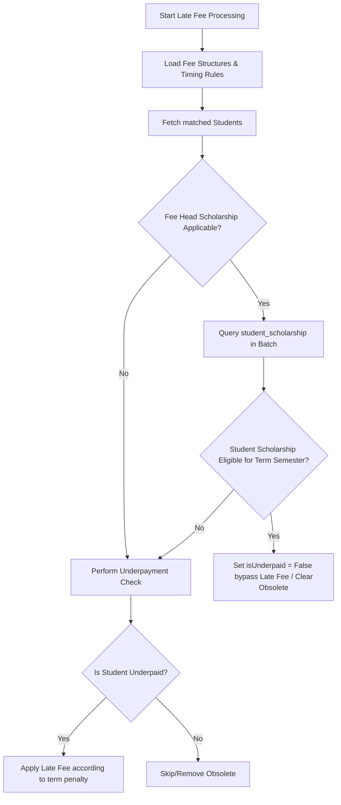

# Documentation: Scholarship Fee Structures & Late Fee Waiver Logic

This document explains the workflow of creating scholarship-applicable fee structures, how the backend late fee controller validates student eligibility, and how late fees are applied or waived across terms.

---

## 1. Fee Structure Creation

Fee structures are defined per academic context (College, Batch, Course, Branch) and category/quota. 

### Configuration Interface
In the **Quota-wise Setup Wizard**:
1. Each **Fee Head** is configured in a row. Ticking **Scholarship (All Years)** marks the entire fee head row as scholarship-eligible.
2. Checking **Scholarship (All Years)** displays individual **Scholarship** checkboxes inside each Year/Semester cell in that row.
3. If some years/semesters are not eligible, you can uncheck them individually. If the main checkbox is unchecked, all cell checkboxes are cleared and hidden.

```
+-----------------------------------+--------------------+--------------------+
| Fee Head / Attribute              | Year 1             | Year 2             |
+-----------------------------------+--------------------+--------------------+
| Tuition Fee                       | [₹ 50,000]         | [₹ 50,000]         |
| [x] Scholarship (All Years)       | [x] Scholarship    | [ ] Scholarship    |
+-----------------------------------+--------------------+--------------------+
```

### Database Representation
When saved, each cell generates a separate `FeeStructure` document in MongoDB containing:
```json
{
  "feeHead": "ObjectId(TuitionFee)",
  "studentYear": 2,
  "semester": null,
  "amount": 50000,
  "isScholarshipApplicable": true // saved per year/semester
}
```

---

## 2. Student Scholarship Eligibility (MySQL)

Student eligibility is recorded sem-wise in the `student_scholarship` table:

| Column | Type | Description |
| :--- | :--- | :--- |
| `student_id` | `int` | Foreign Key referencing `students.id` |
| `student_year` | `int` | Academic year (e.g., `1`, `2`, `3`, `4`) |
| `student_semester` | `int` | Semester (e.g., `1`, `2`) |
| `eligible` | `varchar` | Eligibility status (e.g. `'eligible'`, `'not_eligible'`) |

> [!IMPORTANT]
> **Source of Truth Limitation**:
> The scholarship status is resolved **exclusively** from the `student_scholarship` table. The `scholar_status` column in the `students` table is **not used** as a fallback. If no matching record is found for a year/semester in `student_scholarship`, the student is automatically considered **not eligible** for scholarships in that year/semester, and late fees will apply normally.

---

## 3. Late Fee Controller Processing Flow

The scheduler job processes late fees periodically via `processLateFees` in `lateFeeController.js`:



### Granular Term-to-Semester Mapping & Verification Rules
If a fee head has **divided terms** (e.g., Tuition Fee divided into Term 1 and Term 2):
1. **Explicit Semester Mapping**: If a term is configured with an explicit `referenceSemester` (e.g. Term 1 $\rightarrow$ Sem 1, Term 2 $\rightarrow$ Sem 2), the controller resolves the scholarship status using that semester.
2. **Parent Structure Semester Fallback**: If `referenceSemester` is empty, but the parent structure is semester-specific (`parentStruct.semester` is set), all terms inherit the structure's semester.
3. **Implicit Yearly Mapping (Year-wise structures with no semester)**: If the structure is yearly (`semester = null`) and the term has no `referenceSemester`:
   - **For 2-Term configurations**:
     - **Term 1** maps automatically to **Semester 1**.
     - **Term 2** maps automatically to **Semester 2**.
   - **For 3-Term configurations**:
     - **Term 1** maps automatically to **Semester 1**.
     - **Term 2** maps automatically to **Semester 1** (usually a second installment of Sem 1 fees).
     - **Term 3** maps automatically to **Semester 2** ( installment of Sem 2 fees).

---

## 4. Scenario-Based Application Examples

Here are detailed examples showing how late fees are applied or waived under the term-mapping rules.

### Scenario A: Term-Level Semester-Wise Mixed Eligibility
A student has the following configurations in **Year 2**:
- **Tuition Fee structure**: Scholarship-applicable in Year 2.
- **Terms configuration**:
  - **Term 1**: amount `₹25,000`, `referenceSemester = 1`
  - **Term 2**: amount `₹25,000`, `referenceSemester = 2`
- **Student scholarship registry**:
  - `student_year = 2, student_semester = 1` $\rightarrow$ `eligible = 'eligible'`
  - `student_year = 2, student_semester = 2` $\rightarrow$ `eligible = 'not_eligible'`

#### Results:
- **Term 1 processing**: The late fee job resolves the term's semester as `Sem 1`. Checking the scholarship registry for `Year 2, Sem 1` returns **eligible**. **Late fee is waived/bypassed for Term 1.**
- **Term 2 processing**: The late fee job resolves the term's semester as `Sem 2`. Checking the scholarship registry for `Year 2, Sem 2` returns **not_eligible**. **Late fee is checked and applied for Term 2** if payment is overdue.

---

### Scenario B: Yearly Structure (No Semester) with 3-Term Split & Mixed Eligibility
A student has a yearly fee structure (e.g. `Tuition Fee` for Year 3, `semester = null`).
- **Tuition Fee structure**: Scholarship-applicable in Year 3.
- **Terms configuration**:
  - **Term 1**: `termNumber = 1` (no explicit reference semester).
  - **Term 2**: `termNumber = 2` (no explicit reference semester).
  - **Term 3**: `termNumber = 3` (no explicit reference semester).
- **Student scholarship registry**:
  - `student_year = 3, student_semester = 1` $\rightarrow$ `eligible = 'eligible'`
  - `student_year = 3, student_semester = 2` $\rightarrow$ `eligible = 'not_eligible'`

#### Results:
- **Term 1 processing**: Since it is a yearly structure, the controller maps `Term 1` implicitly to **Semester 1**. Checking the scholarship registry for `Year 3, Sem 1` returns **eligible**. **Late fee is waived for Term 1.**
- **Term 2 processing**: The controller maps `Term 2` implicitly to **Semester 1**. Checking the scholarship registry for `Year 3, Sem 1` returns **eligible**. **Late fee is waived for Term 2.**
- **Term 3 processing**: The controller maps `Term 3` implicitly to **Semester 2**. Checking the scholarship registry for `Year 3, Sem 2` returns **not_eligible**. **Late fee is checked and applied for Term 3** if payment is overdue, using the late fee rules configured for Term 3.

---

### Scenario C: Non-Scholarship Fee Head
A student is fully eligible for scholarships in all semesters of Year 2.
- **Lab Fee structure**: `isScholarshipApplicable = false`.

#### Results:
- The late fee job checks `Lab Fee` $\rightarrow$ The head is **not scholarship-applicable** $\rightarrow$ Scholarship registry is ignored.
- Underpayment is checked $\rightarrow$ If the student fails to pay the Lab Fee by the term due dates, **late fees are applied** according to the configured penalty amounts.

---

### Scenario D: Retroactive Scholarship Approval (Automatic Clean-up)
1. **Due Date passes**: A student is underpaid on Tuition Fee (scholarship-applicable). At this time, their scholarship application is pending in MySQL (`eligible = 'pending'`).
2. **Late Fee Generated**: The controller runs and applies a `₹1,000` late fee.
3. **Scholarship Approved**: The SQL registry is updated to `eligible = 'eligible'`.
4. **Obsolete Cleanup**: The next run of the late fee job detects the student is now eligible. It sets `isUnderpaid = false`. Finding an existing unpaid late fee record for this term, the controller **automatically deletes the late fee**, restoring the student's dues to normal.
